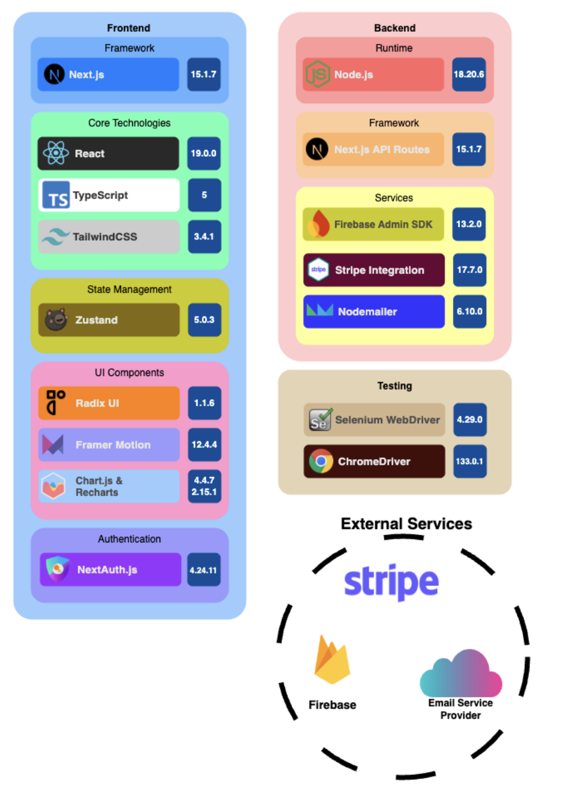
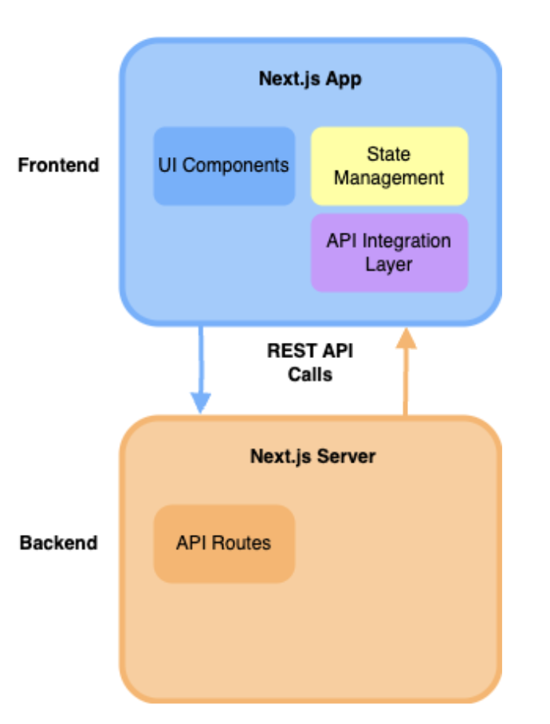

# Project Analysis and Documentation

## Tech Stack

Our application is built using a modern full-stack setup optimized for speed, modularity, and cloud deployment.

The stack includes:

- **Frontend**: Next.js App Router with React, TypeScript, and Tailwind CSS
- **Authentication**: Firebase Auth and NextAuth.js
- **Backend**: Next.js API Routes powered by Node.js
- **Database**: Firebase Firestore (NoSQL)
- **Payments**: Stripe Integration
- **Email**: Nodemailer with a secure SMTP provider
- **State Management**: Zustand
- **UI Components**: Radix UI, Framer Motion, Chart.js & Recharts
- **Testing**: Selenium WebDriver with ChromeDriver
- **Deployment**: Vercel (CI/CD, hosting, serverless functions)

---

## System Architecture

The following diagram illustrates the high-level architecture of the system and how the frontend and backend communicate:

### Overview

- The **Next.js App** handles rendering, state management, and API consumption.
- API calls made from the frontend route to **Next.js API Routes** (server functions).
- These server routes handle interactions with Firebase (auth, Firestore), Stripe, and Nodemailer.
- The app follows a **clean separation of concerns**, allowing the frontend and backend to scale independently.

---

## Key Development Details

### 1. Login Page (`src/app/login/page.tsx`)

**Purpose**: Handles user authentication.  
**Key Features**:

- Uses Firebase Authentication for email/password login.
- Integrates `react-firebase-hooks` for authentication.
- Supports Google OAuth login via `next-auth`.
- Redirects authenticated users to the dashboard.
- Includes form validation for email and password fields.  
  **Firestore Usage**: None directly, but Firebase Authentication is used.

---

### 2. Dashboard Page (`src/app/dashboard/page.tsx`)

**Purpose**: Displays an overview of user-specific data.  
**Key Features**:

- Fetches portfolio data, trading rules, and metrics using `useDashboardData` (custom hook).
- Displays KPIs, portfolio charts, and a list of trading rules.
- Includes navigation to the Rule Builder page for creating new trading rules.
- Uses Zustand for state management (`dashboardStore`).
- Implements error handling and retry mechanisms.  
  **Firestore Usage**: Reads trading rules and metrics via API calls.

---

### 3. Trading Rules Page (`src/app/rule-builder/page.tsx`)

**Purpose**: Allows users to create, edit, and delete trading rules.  
**Key Features**:

- Multi-tab interface for defining universe, signals, holding periods, and exit conditions.
- Validates rule completeness before saving.
- Saves trading rules to Firestore under the authenticated user's collection.
- Uses Firebase Firestore SDK (`setDoc`) for persistence.  
  **Firestore Usage**: Writes trading rules to Firestore.

---

### 4. Session Page (`src/app/session/page.tsx`)

**Purpose**: Displays session information for the logged-in user.  
**Key Features**:

- Fetches session data from `next-auth` and Firebase.
- Retrieves Firebase tokens from cookies.
- Displays session details in a user-friendly format.  
  **Firestore Usage**: None.

---

### 5. Check Session Page (`src/app/checkSession/page.tsx`)

**Purpose**: Debugging page to check session validity.  
**Key Features**:

- Fetches session data from `next-auth`.
- Logs Firebase tokens for debugging purposes.  
  **Firestore Usage**: None.

---

### 6. API Endpoints

- **Portfolio API** (`src/app/api/portfolio/route.ts`):  
   Fetches portfolio data for the dashboard.
- **Metrics API** (`src/app/api/metrics/route.ts`):  
   Fetches performance metrics for the dashboard.

---

### 7. Firebase Configuration (`src/app/firebase/config.js`)

**Purpose**: Initializes Firebase services.  
**Key Features**:

- Configures Firebase Authentication and Firestore.
- Ensures compatibility with server-side rendering.  
  **Firestore Usage**: Provides the Firestore instance for the app.

---

### 8. Selenium Tests (`src/selenium-tests/testDashboard.js`)

**Purpose**: Automates testing for the dashboard.  
**Key Features**:

- Logs in using test credentials.
- Simulates user actions like adding trading rules and navigating the dashboard.  
  **Firestore Usage**: None directly, but tests features that interact with Firestore.

---

### 9. Stripe Payment Integration

**Purpose**: Handles subscription payments and management.  
**Key Features**:

- **Pricing Page** (`src/app/pricing/page.tsx`):  
  Uses `pricing/utils/checkout.js` to make an API call to the `create-subscription` route.  
  Redirects users to Stripe for secure payment processing.

- **Manage Subscription Page** (`src/app/manage-subscription/page.tsx`):  
  Redirects users after payment completion.  
  Interacts with the following API routes:
  - **Retrieve Session API** (`src/app/api/retrieve-session/route.ts`):  
    Fetches the current subscription session details.
  - **Cancel Subscription API** (`src/app/api/cancel-subscription/route.ts`):  
    Allows users to cancel their active subscriptions.
  - **Spending History API** (`src/app/api/spending-history/route.ts`):  
    Retrieves the user's payment and spending history for display.
    
---

### 10. Contact Page (`src/app/contact/page.tsx`)

**Purpose**: Enables users to get in touch for support, technical issues, or general inquiries.  
**Key Features**:

- **Contact Form** (`src/app/contact/page.tsx`):  
  Provides input fields for name, email, subject, and message.  
  Validates all fields and sends the form data via a POST request to the `/api/email` endpoint.  
  Backend handles submission using **`nodemailer`** to send an email to the support team.  
  Displays a success or error alert based on the response.

- **Contact Information Panel**:  
  Displays office address, support email, business hours, and phone number. Includes icons for clarity.

- **Social Media Links**:  
  Provides quick access to LinkedIn and Instagram accounts via icon buttons.

- **Interactive Map** (Google Maps API):  
  Embeds a live map showing the physical office location using an iframe from Google Maps.

- **FAQ Section**:  
  Contains commonly asked questions and answers covering response time, technical support, demo scheduling, and access to documentation.

---

## Future Development

### <ins>Ideas:</ins>

### Real-Time Updates

- Implement Firestore listeners to enable real-time updates for trading rules and metrics.

### Enhanced Error Handling

- Add user-friendly error messages for API failures.

### Role-Based Access Control

- Extend Firebase Authentication to support roles (e.g., admin, user).

### Comprehensive Testing

- Expand Selenium tests to cover edge cases and additional user flows.

### Mobile Responsiveness

- Optimize UI components for mobile devices.

### Analytics Dashboard

- Add advanced analytics and visualizations for trading performance.

### Localization

- Support multiple languages for a global user base.

---

## Steps for future developers:
- Use firebaseAuth + firestore for this app, setup on Alfina's official google console (sign in using alfina tech's official google login credentials)
- To reploy this website on a custom domain with admin controls over deployment, create a new deploymnet on preferred vercel user account
- Clone this repository and set it's main branch as the target branch for vercel deployment
- Assign environment variables using deployment settings on vercel. The values for environment variables will be shared privately with Alfina's executives using our official channel of communication on discord. These include environment variables for Github and Google Auth secrets and keys, Stripe integration, email notifcation integration, NextAuth, and Firebase client id and secret. 
- Set custom build commands for deployment, suited for this next.js project: `npm install`, `npm run build`
- Deploy on vercel using custom domain url(s)
