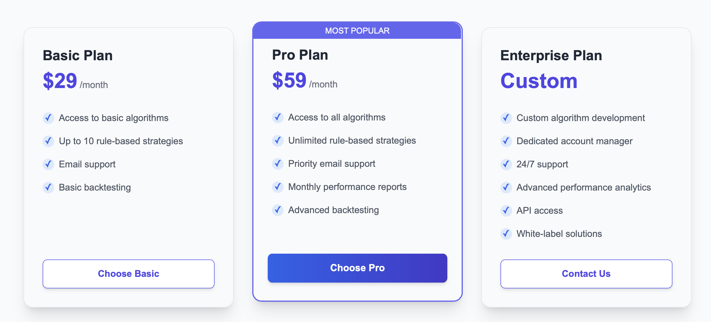

# Alfina Trading Platform

Deployed site is available at: [https://project-20-alfina-technologies-deploy.vercel.app/](https://project-20-alfina-technologies-deploy.vercel.app/)

## Introduction

### Overview

Alfina Trading Platform is a fintech application designed to help traders build, test, and optimize quantitative trading strategies efficiently. The platform offers a no-code strategy builder, an interactive backtesting dashboard, and an advanced feature engineering system that empowers traders of all skill levels.

### Aims

Traditional quantitative trading often demands deep technical expertise, manual backtesting, and relies heavily on spreadsheets or complex code, making it error-prone and inefficient. The Alfina Trading Platform simplifies this process by offering a modular, user-friendly system for streamlined strategy development and evaluation. Our team supported Alfina’s transformation by rebuilding their website and integrating key features, including an interactive rule builder, stock universe management, user authentication with cookie handling, contact forms for user engagement, a novel UI, and clearly structured pricing plans.

### Key Features

- **Strategy Management:** Manage and review past and current trading strategies with key performance indicators. 
- **Interactive Data Exploration:** Leverage hover tooltips for instant metric descriptions. 
- **Signal Management:** Track live signals and stock performance for prompt decision-making.
- **Sandbox for Testing & Optimization:** Experiment with trading scenarios and variables in a dedicated testing environment.

---

## Feature Description

1. **Strategy Management**

   - **Description:** View and manage your trading strategies through a comprehensive dashboard displaying historical data and financial metrics.
   - **Benefits:** Enables quick assessment and modification of trading strategies with real-time performance indicators.

2. **Interactive Data Exploration**

   - **Description:** Get quick insights with hover tooltips that explain key financial and strategy metrics.
   - **Benefits:** Enhances understanding of complex data, reducing the learning curve for non-technical users.

3. **Signal Management**

   - **Description:** Monitor real-time signals and the performance of related stocks, enabling quick analysis and action.
   - **Benefits:** Streamlines the process of identifying actionable trading opportunities.

4. **Sandbox for Testing & Optimization**
   - **Description:** A dedicated environment for creating variables and simulating trading scenarios, allowing for thorough backtesting.
   - **Benefits:** Offers a risk-free space to optimize trading strategies before live deployment.

### Usage Instructions

1. **Accessing the Application**

   - **User Registration:** Sign up via the web platform or use provided demo accounts.
   - **Login:** Enter your credentials to access the dashboard.
   - **Subscription:** Purchase your preferred subscription through the pricing page. Simply select Basic or Pro for the payment step.
   - **Dashboard Overview:** Once logged in, view your existing strategies, key financial metrics, and available trading models.

2. **Creating a New Strategy**

   - **Step 1:** Click on the **"+ Add New Trading Rule"** button on the dashboard.
   - **Step 2:** Choose one of the available model types.
   - **Step 3:** Define your universe of securities.
   - **Step 4:** Configure signals by:
     - Specifying the primary signal (mandatory).
     - Optionally adding meta signals to filter false positives.
     - Setting holding periods and exit conditions.
   - **Step 5:** Save and deploy your strategy.

3. **Monitoring Strategies & Signals**

   - **Dashboard Monitoring:** Review historical performance data and active trading signals.
   - **Interactive Tooltips:** Hover over metrics for brief explanations, and click for in-depth details.
   - **Learning Resources:** Access educational content via the Alfina Academy links.
---

## User Flow

1. **Login Flow**

   

   The login/signup interface where users enter their credentials. A user may opt to sign in with their Google or Github account.

2. **Dashboard Overview** (`/dashboard`)

   

   The main dashboard displaying trading rule/model management, key metrics, and portfolio status. User can hover over info icons to learn about unfamiliar financial metrics/terminologies. User can create new trading rules/stragies through the dashboard:

3. **Creating a New Strategy** (`/rule-builder` and `/stockrulebuilder`)

   

   Rule/strategy builder, with sections to define the universe, primary/meta signals, holding period and exit condition. By clicking "Create Custom Feature", the user can access the even more customizable feauture builder:

     

   On this page, users can define their own features using complex arithmetic operations. After saving a custom feature, a user can use this feature to build a personalized rule that aligns with their unique trading strategy.

   
   
   The user's trading rules can be found on the dashboard page (`/dashboard`), with all the necessary information available at a glance. The user can search for specific rules and sort the rules based on numerous conditions, ensuring maximum organization.

4. **Purchasing a Subscription Flow** (`/pricing`)

   

   Choose your preferred subscription from the pricing page. You will then be redirected to the Stripe platform for payment processing.

   

   You will notice the pro plan details in the top left. Enter the dummy credit card (4242 4242 4242 4242) with any valid expiry to proceed back to the site.

   

   You will be redirected back to the Manage Subscription page. You can view the details of your subscription and also track your spending on the platform. The graph shows you the date and amount for the your paid invoices associated with your account.

5. **Contact Page Flow** (`/contact`)

   On the Contact page, users can reach out to our team by filling out a simple form with their name, email, subject, and message. The form ensures that all fields       are completed before submission.

   

   Below the form, we display an interactive map powered by the Google Maps API, allowing users to easily locate our office and get directions.

   

   We also have an interactive map that we use to get the address of the office. Which users can use to get the route to the office thorugh google maps.
   
   


   We’ve also included a helpful FAQ section to quickly address common questions related to support, demos, response time, and documentation.
   

---

## Testing the Features

1. **Creating a Test Account**

   - **Registration:** Follow the on-screen instructions to create a new user account.
   - **Test Credentials:**
     - Email: `test@gmail.com`
     - Password: `password`

2. **Accessing Different Functionalities**

   - **Navigation:** Dashboard allows the user to get birds-eye view of portfolio and rules. In the dashboard, the user can view his own trading strategies and create new ones. Inside the trading strategy creator/editor, there are many options, organized by tabs and by the "Modular Payload System" button.
   - **Test Scenarios:**
     - Create and deploy a new trading strategy.
     - Monitor real-time signal notifications.

3. **UI testing**

   - We have selenium tests for that in the folder "webapp/src/selenium-tests".
   - You can have the application run on the local machine with npm run dev and use another terminal to run the selenium tests, using node <filename>.

4. **Subscription Testing**
   - Follow the steps in the subscription user flow above to test out the Stripe payment integration. Head over to the /pricing page!
   - As mentioned, you can use this dummy credit card - `4242 4242 4242 4242` - with any valid expiry.

---

## Dev Instructions

1. **Prerequisites**

   - **Dependencies:**
     - Node.js (v18 or later)

2. **Project Setup**

   - **Clone the Repository:**
     ```bash
     git clone git@github.com:csc301-2025-s/project-20-alfina-technologies.git
     cd project-20-alfina-technologies/webapp
     ```
   - **Install Dependencies:**
     Run `npm install`
   - **Environment Variables:**
     - Create a `.env` file in the root directory:
       ```
       GOOGLE_SECRET=[YOUR_API_KEY]
       ```

3. **Running the Application**

   - **Development Server:**: Run `npm run dev`

   The application will be accesible at `http://localhost:3000`.

---

## Deployment Instructions

1. **Environment Variables/Configuration**

   - **Required Variables:**
     - `GOOGLE_CLIENT_ID`
     - `GOOGLE_CLIENT_SECRET`
     - `GITHUB_CLIENT_ID`
     - `GITHUB_CLIENT_SECRET`
     - `NEXTAUTH_SECRET`

2. **Deployment Steps**

   1. **Connect Your Repository to Vercel**

      - Go to [vercel.com](https://vercel.com/) and log in (or sign up).
      - Click **“New Project”** → **“Import Git Repository”**.
      - Select your GitHub repository (e.g., `project-20-alfina-technologies/webapp`).

   2. **Configure Build Settings**

      - Vercel should detect it’s a **Next.js** project automatically.
      - The default build command is:
        ```bash
        npm install
        npm run build
        ```
      - The default output directory is `.next`.

   3. **Set Environment Variables**

      - In **Vercel → Project Settings → Environment Variables**, add any required variables (e.g., `GOOGLE_SECRET`, `EMAIL_USER`, `EMAIL_PASS`).
      - Use **Production** (or **Preview**/**Development**) depending on your environment needs.

   4. **Deploy**

      - After saving your environment variables, click **Deploy**.
      - Vercel will run `npm install` and `npm run build` automatically.
      - Once the build is complete, you’ll get a production URL (e.g., `https://your-app-name.vercel.app`).

   5. **Verify**

      - Visit the URL to confirm the application is live.
      - Test key features (login, creating strategies, etc.) to ensure everything works in production.

   6. **Ongoing Updates**
      - Every time you push changes to the branch connected to Vercel (usually `main`), Vercel will automatically rebuild and redeploy.
      - If you need a separate staging environment, create a different project or connect a different branch to Vercel.

---

## Deployment and GitHub Workflow

- **Branching Strategy:**  
  We maintain the main branch as the production-ready code. We have a branch "BACKUP_D@\_CHECKPOINT" which was our backup in case the main has some faults. We have a "deploy" branch which is the code from [https://github.com/SGuransh/project-20-alfina-technologies](https://github.com/Krisha-11/project-20-alfina-technologies-deploy) (This is the repo we forked to have the application deployed because hosting from GitHub organization accounts is paid and the partner's approval is needed).
  We try to make the branches from the issues that are raised and if not we just use the feature name that we are working on. Once the feature is complete and at least one person has reviewed or added a comment that the branch is ready to be merged, we merge it in the main branch.
- **Pull Requests:**  
  We review the branches before merging the changes into the main branch. On the bi-weekly meeting that we have, we save the backup to the main. This has to be improved upon and we will work on the creation of a CI/CD pipeline.
- **Merge Policy:**  
  The pull request is reviewed and tested by one other person, preferably someone who is in the same subgroup. If the code is behaving as expected and the code is approved, then it is merged into the main branch.
- **Justification:**  
  The is a rather lenient workflow, which is based on a lot of communication and a bit of safety and collaboration. Mandatory reviews and comments help make a stable codebase.

---

## Coding Standards and Guidelines

We follow industry-standard coding conventions with a focus on clear documentation, modular architecture, and consistent styling.

This project follows industry-standard frontend development practices with a focus on modular design, maintainability, and clear, consistent styling. The web application is built using **Next.js** and **Tailwind CSS**, with **Selenium** used for end-to-end and unit testing.

### Project Structure

- The codebase uses a feature-based directory structure, where each major functionality (e.g., authentication, rule builder, stock universe) is grouped into its own folder for improved clarity and scalability.

- A dedicated `/apis`` directory manages the internal data flow between different pages and the dashboard. Although there is no backend, this structure ensures a clean and modular approach to passing and organizing data across components.

### Styling and UI Development
- Styling is handled using Tailwind CSS, following a utility-first approach that enables rapid UI development and consistent design.

- Reusable components are created wherever possible, e.g. the menu bar, to promote DRY (Don't Repeat Yourself) principles and maintain a unified look and feel across the app.

### Route Protection and Middleware
- A `/middleware`` directory is used to handle route protection and control access to specific pages.

- This directory contains logic for managing user authentication status and enforcing access rules across the application, applied globally to ensure consistent behavior.

### Testing
- Selenium is used for end-to-end testing to simulate real user behavior and verify that key flows—such as login, navigation, and interactive features—work reliably.

### Code Quality and Conventions
- All major logic blocks and components are documented with comments to support readability and onboarding.

- Environment-specific settings are managed securely using .env files.

- A clear Git workflow is followed, using feature branches, descriptive commit messages, and pull request reviews to support collaborative development.

---

## Licenses

This project is licensed under the MIT License, which is widely recognized for its permissiveness and simplicity. The MIT License allows for both personal and commercial use, modification, and distribution of the code. It also provides the freedom for other developers and collaborators, including those working with our partners, to contribute to the codebase as needed.

By choosing the MIT License, we aim to foster an open and collaborative environment that accelerates development and promotes innovation while maintaining legal clarity and ease of use for all contributors.

---

**Partner Information**

- **Organization:** Alfina Technologies
- **Primary Contact:** Kevin Li, Founder
- **Email:** kevinyangfan.li@mail.utoronto.ca

---

**Contributors:** Jakub Gierus, Guransh Singh, Nauhar Kapur, Raunak Madan, Krisha Kalsi, Gurveen Sahni, Shabhaz Singh

